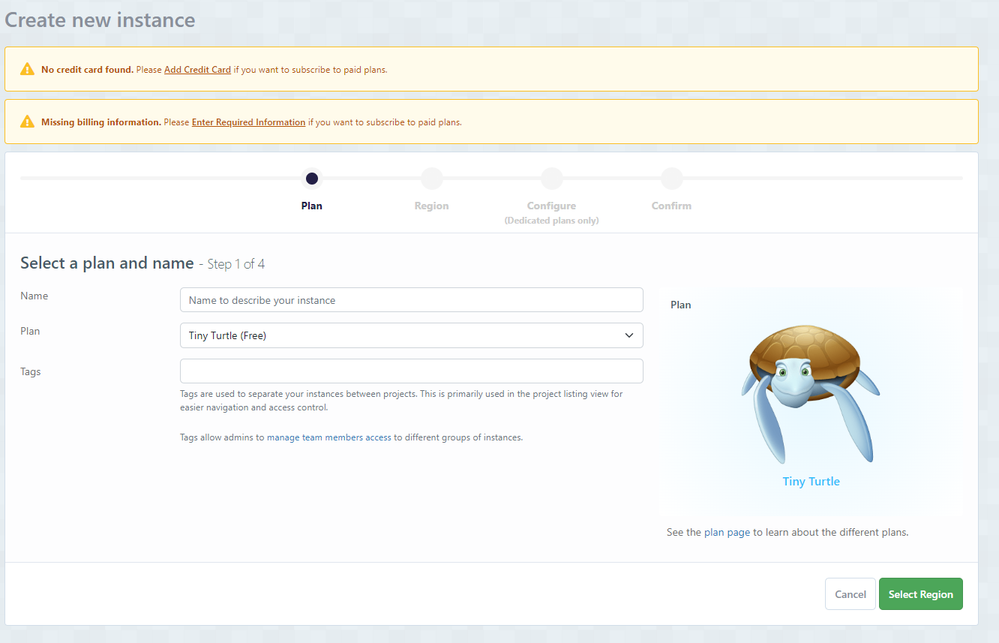
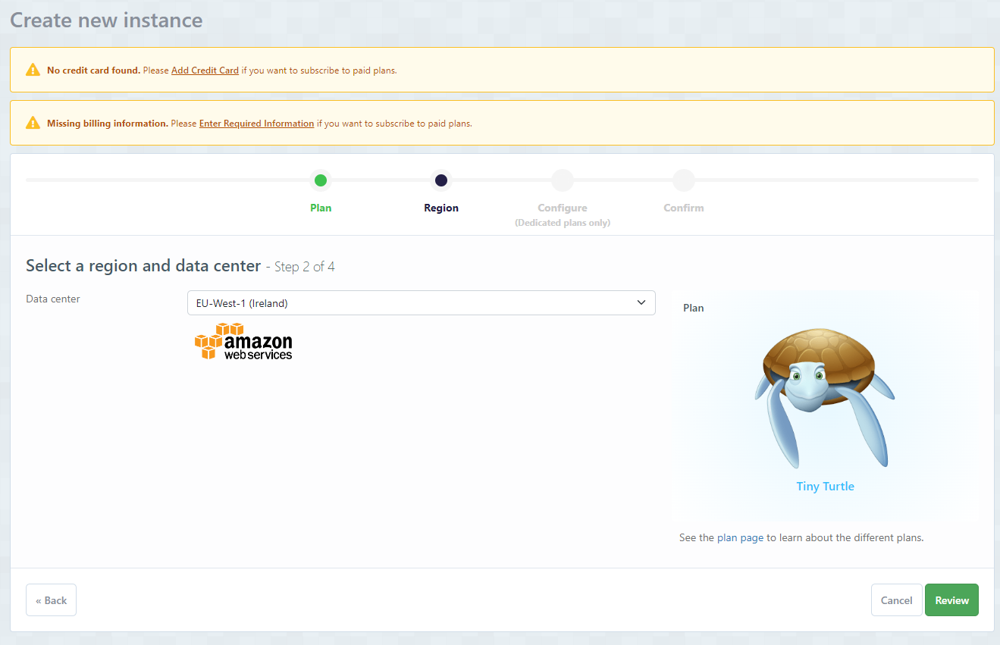
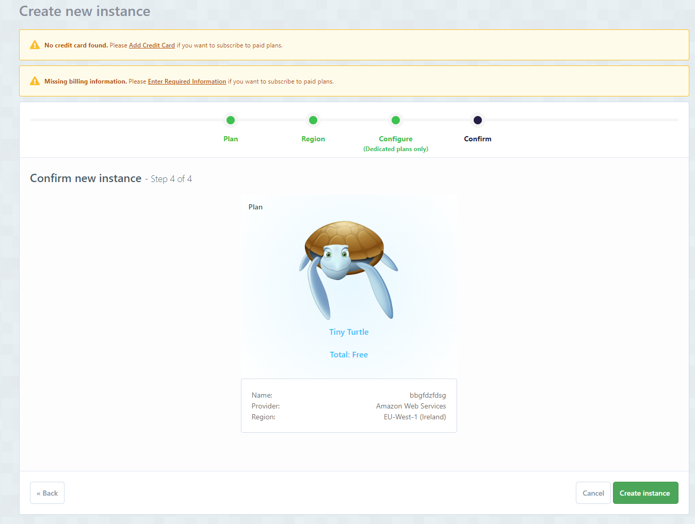
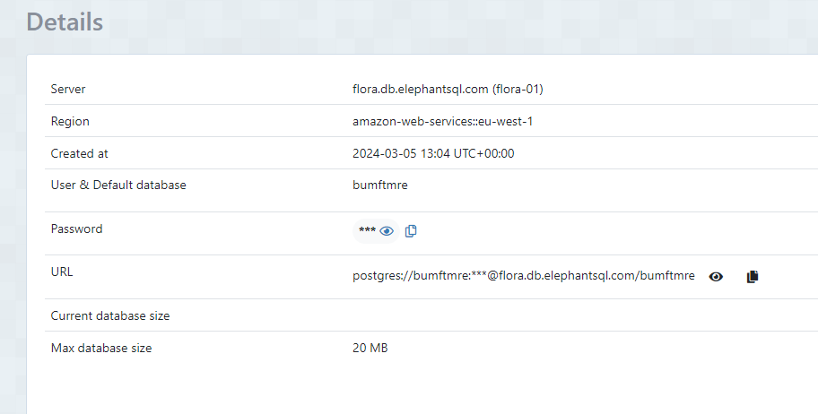

# Deployment and Setup


## Heroku Deployment


1. Create a Heroku account if you don't already have one.

2. Create a new app on Heroku.

    1. Go to the [Heroku dashboard](https://dashboard.heroku.com/apps).
    2. Click on the "New" button.
    3. Click on the "Create new app" button.
    4. Choose a name for the app.
    5. Choose a region.
    6. Click on the "Create app" button.

3. In the app go to the "Resources" tab.

    1. Add a Heroku Postgres database.

4. In the app, go to the "Settings" tab, press "Reveal Config Vars", and add the following config vars:

    1. ```CLOUDINARY_CLOUD_NAME``` = the cloud name used for creating a cloudinary account.
    2. ```CLOUDINARY_API_KEY``` = the api key used when creating a cloudinary account.
    3. ```CLOUDINARY_API_SECRET``` = the api secret used when creating a cloudinary account.
    4. ```DATABASE_URL``` = the url of the heroku postgres database.
    5. ```SECRET_KEY``` = a secret key for the app.
    6. ```DISABLE_COLLECTSTATIC``` = set to '1' during development. Removed when deploying to production.
 

5. In the app go to the "Deploy" tab.

    1. Connect the our Heroku account to the GitHub account and then click on the "Deploy" button.

6. Go to the local repository.

7. Create Procfile.


8. Create ```requirements.txt```. This can be done by running the following command:

    - ```pip freeze > requirements.txt```
    or
    - ```pipreqs requirements.txt``` - if you have pipreqs installed.

9. Add and commit all changes.

10. Push your changes to Heroku.

    - ```git push heroku master```
    or
    - ```git push heroku main```

11. Check your app's logs in heroku dashboard and ensure everything is working.

12. After the development is done, change the ```DEBUG``` config var to ```False``` and remove the ```DISABLE_COLLECTSTATIC``` config var from the config vars on heroku.

#### To get Cloudinary cloud name, API key, and API secret:

1. Go to the [Cloudinary website](https://cloudinary.com/).

2. Log in to the account or sign up.

3. Go to the [Cloudinary dashboard](https://cloudinary.com/console/).

4. At the top of the page, there is the API key, and API secret.

5. To reveal API secret, hover over the API key container and click on the button that looks like an eye.

6. Copy these values and paste them into the config vars on Heroku and into the `env.py` file.

---

## ElephantSQL Setup

### Create Database on ElephantSQL

1. Go to [ElephantSQL](https://www.elephantsql.com/) and create a new account.

2. Create a new instance of the database.

    - 

3. Select a name for your database and select the free plan.

    - 

4. Click "Select Region"

    - 

5. Confirm New Instance

    -   


6. Click "Create Instance"

    - 

7. Click on the name of your database to open the dashboard.

    - 

8. You will see the dashboard of your database. You will need the URL of your database to connect it to your Django project.
